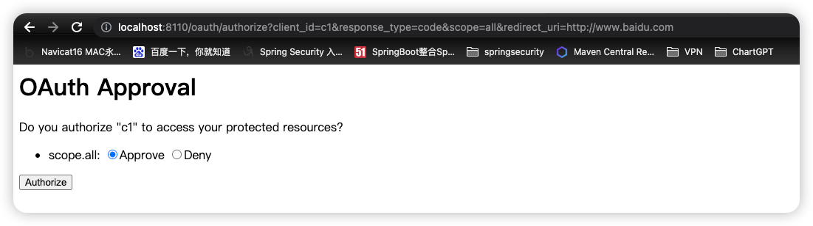
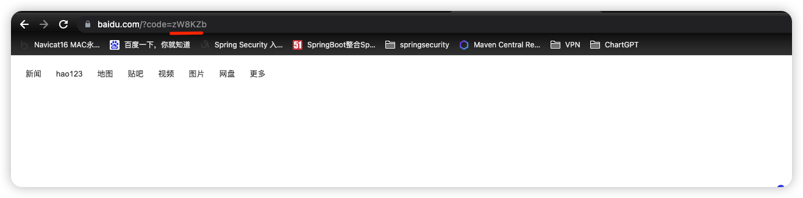
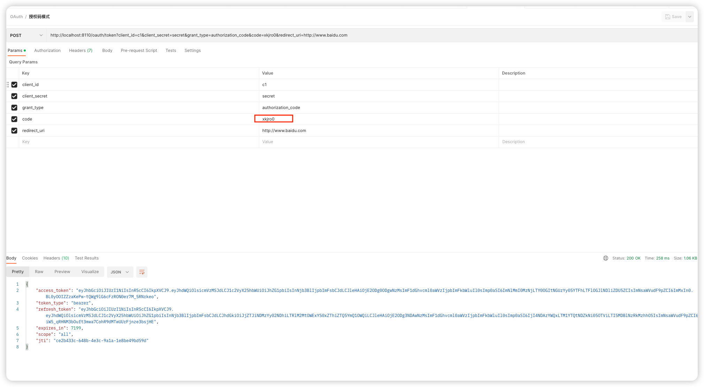
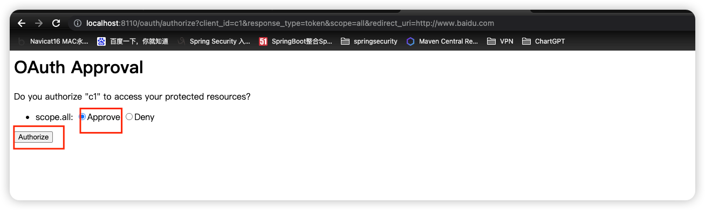
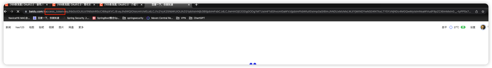
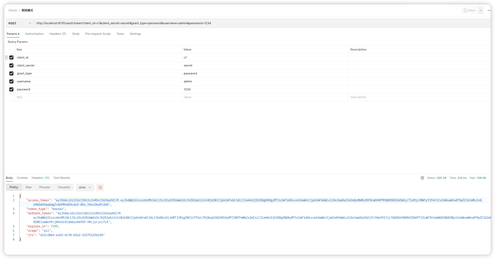
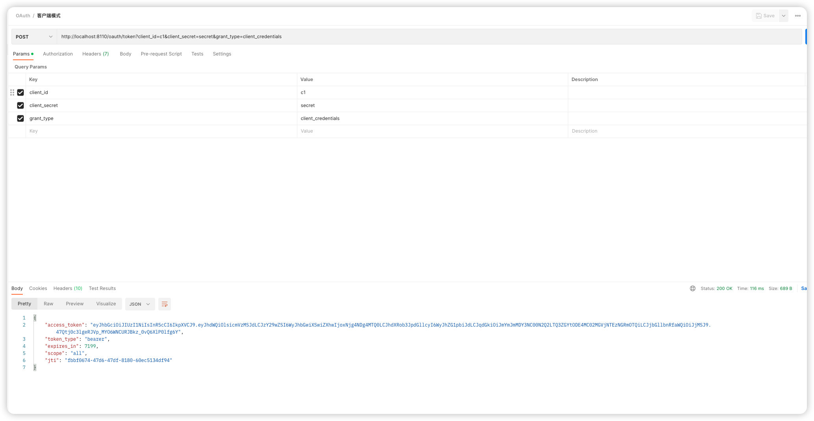

一.授权码模式

a.先获取授权码，向浏览器访问下面路径：
http://localhost:8020/oauth/authorize?client_id=c1&response_type=code&scope=all&redirect_uri=http://www.baidu.com

b.下面我们使用PostMan拿着这个授权码，使用POST方式获取Token

二、简化模式
a.浏览器访问：http://localhost:8110/oauth/authorize?client_id=c1&response_type=token&scope=all&redirect_uri=http://www.baidu.com

返回token

三、密码模式
a.使用PostMan 发送POST请求： http://localhost:8110/oauth/token?client_id=c1&client_secret=secret&grant_type=password&username=admin&password=1234

四、客户端模式
a.使用PostMan 发送POST请求:  http://localhost:8110/oauth/token?client_id=c1&client_secret=secret&grant_type=client_credentials

